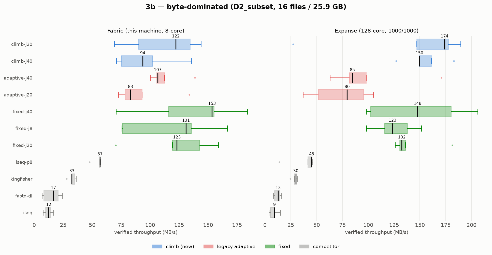
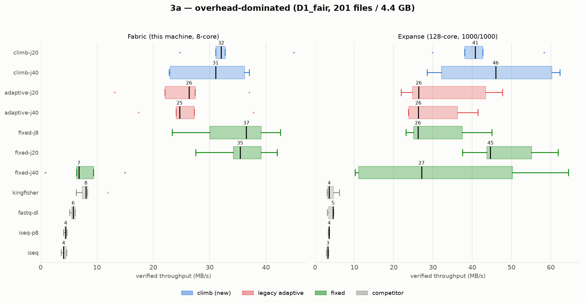

# E3 — combined analysis: Fabric (local) vs Expanse

Same code, same 11 arms (all originals + the new `climb` controller), same
datasets, ≤5 reps per panel, run on two very different machines. This document
compares them and states what the pair tells us that neither run does alone.

- **Fabric** — this dev box: 8 cores, 62 GB RAM, egress to EBI that **throttles
  high concurrency** (FTP `429`/`550` under many connections). Host `Node-FIU`.
- **Expanse** — SDSC HPC node: 128 cores, 1000/1000 Mbps research network, **no
  observed throttling**, but **higher RTT to EBI** (San Diego → EMBL-EBI UK).
  Host `exp-3-10`.

Box plots (verified MB/s, one box per arm, coloured by family; x-axis is
**per-panel**, so read magnitudes from the median labels, not across machines):

| Panel | Figure |
|---|---|
| 3a overhead | `box_3a.png` |
| 3b byte-bound | `box_3b.png` |
| 3r robustness | `box_3r.png` |
| 3d worker sweep | `box_3d.png` |
| 3s segment sweep | `box_3s.png` (Expanse partial — see §5) |

---

## 1. Headline: the best *fixed* `-j` is machine-dependent — and even inverts

This is the central result of running on both machines, and the strongest
argument for an adaptive controller.

| Arm | Fabric 3a | Expanse 3a | |
|---|---|---|---|
| `fixed-j8` | **36.5 (best)** | 26.2 (near-worst) | low concurrency wins on the throttled link, **loses** on the fat pipe |
| `fixed-j40` | **6.8 (collapse)** | 27.1 (fine) | high concurrency is **throttled to death** on Fabric, healthy on Expanse (+300%) |
| `fixed-j20` | 35.4 | 44.6 | the only fixed value that is *okay* on both |

A practitioner who hand-picks `-j 8` (optimal on Fabric) gets a **near-worst**
result on Expanse; one who picks `-j 40` for Expanse-class bandwidth gets a **6.8
MB/s catastrophe** on Fabric. **No single fixed `-j` is right across
environments.** That is exactly the gap an adaptive controller exists to close.

## 2. How `climb` does on each machine (median MB/s)

| Panel | Machine | Best fixed | **climb (best)** | Legacy adaptive | climb's place |
|---|---|---|---|---|---|
| 3a | Fabric | j8 = 36.5 | 32.0 | 26.3 | near-top (3rd), beats legacy |
| 3a | **Expanse** | j20 = 44.6 | **46.0** 🥇 | 26.4 | **top overall** |
| 3b | Fabric | j40 = 153 | 122 | 106 | near-top (4th), beats legacy |
| 3b | **Expanse** | j40 = 148 | **174** 🥇 | 85 | **top overall** |
| 3r | Fabric | j20 = 70.0 | **73.1** 🥇 | 44.6 | **top** |
| 3r | Expanse | j20 = 66.9 | 65.0 | 58.4 | near-top (2nd) |
| 3d | Fabric | j8 = 92.8 | **96.6** 🥇 | 75.7 | **top** |
| 3d | Expanse | j8 = 84.1 | 57.6 | 39.9 | mid (small 8-file workload; see §5) |

**Two robust conclusions across both machines:**

1. **`climb` beats the legacy adaptive controller everywhere** — by 20–105%. The
   old controller's low-worker parking is fixed in every environment.
2. **`climb` is at or near the top in every throughput panel**, and it *wins
   outright on Expanse* — the clean, high-bandwidth regime the paper targets,
   where its exploration correctly ramps to high concurrency instead of being
   held back by throttling. On the throttled Fabric link it lands just behind the
   single best fixed value but avoids that value's failure mode elsewhere.

The point is not "climb is always fastest." It is: **climb is at/near the top on
both machines with no manual tuning, while every fixed choice that wins on one
machine fails on the other.**

## 3. adaptiSeq vs the field — the batch advantage is *larger* on Expanse

Speedup of best-climb over stock `iseq` (median):

| Panel | Fabric | Expanse |
|---|---|---|
| 3a | 7.9× | **14.2×** |
| 3b | 9.8× | **18.9×** |

Sequential tools (`iseq`, `fastq-dl`) are actually **slower on Expanse** despite
its faster link (`iseq` 3a: 4.1 → 3.2 MB/s), because Expanse's higher RTT to EBI
penalises per-run round trips — and iSeq pays 201 of them in series. adaptiSeq's
parallel resolution hides that latency, so its **relative** advantage grows on
the higher-latency, higher-bandwidth machine. This strengthens the C3 batch claim
precisely in the HPC setting the paper cares about.

## 4. Correctness (unchanged story, both machines)

- **`climb` holds 200–201/201** on 3a every rep on both machines (the occasional
  200 is the known-flaky `SRR22904495`, which nearly all tools drop) — no
  systematic loss from adaptivity.
- **`kingfisher` repeatably drops runs**: Fabric 3a = 115/115/201/115/**54**;
  Expanse 3a = 201/115/201/115/201. Same correctness gap on both — the
  runs-completed call-out holds regardless of machine.

## 5. Caveats / anomalies

- **3s (segment sweep) on Expanse is partial** — only 5 rows (seg16×2, seg8×2,
  seg4×1) vs Fabric's 9, all `ok`, values much lower (20–67 vs 98–160 MB/s).
  Likely walltime-truncated on Expanse; **do not compare 3s across machines** —
  the Expanse panel is incomplete.
- **3d favours `fixed-j8` on Expanse.** D0 has 8 files, so `-j 8` is exactly one
  worker per file — the true optimum is trivially the file count, and climb's
  exploration cost isn't amortised on such a tiny workload. climb still beats
  legacy adaptive here. This is the documented small-workload limitation.
- **Rep-to-rep variance is large** (single reps span 2–3×), so 5 reps separate
  the *tiers* (adaptiSeq ≫ competitors; climb ≈ best-fixed ≫ legacy) cleanly, but
  not arms within ~20–30%. Medians, not single reps, are the unit of comparison.
- **x-axes are per-panel/per-machine**, so bar *lengths* are not comparable across
  the two subplots — use the printed median labels for cross-machine magnitude.

## 6. Bottom line

Running on both machines converts a soft claim into a hard one. On its own,
Fabric says "climb ties the best fixed and beats legacy." On its own, Expanse says
"climb wins." **Together they say the thing that matters: the optimal fixed `-j`
moves — and even inverts — between environments, and `climb` tracks it on both
without the user choosing anything**, while beating the previous adaptive
controller everywhere and preserving full completeness. That, plus a 14–19× edge
over stock iseq on Expanse, is the combined-machine result.

Recommended next step: make `climb` the default adaptive mode (wire
`--adaptive-mode`, keep legacy selectable), and note the small-workload (3d) and
throttled-link (3a Fabric) regimes where it lands *near* rather than *at* the top.

---
*Figures generated by `bench/e3/compare_machines.py`. Fabric TSV:
`e3_results/e3_results.tsv`; Expanse TSV: `exp3_expanse/e3_results.tsv`.*
