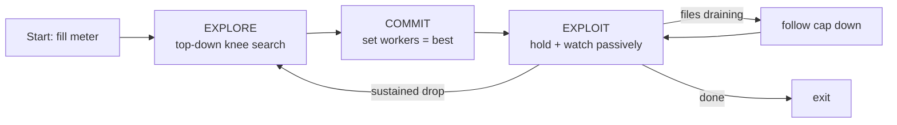

# Adaptive worker controller — `climb` mode

How adaptiSeq decides *how many workers to run* during a batch download, so the
user never has to pick `-j` by hand and still gets throughput at or above the
best hand-tuned fixed value.

Enable with `ASEQ_ADAPTIVE_MODE=climb` (the legacy gradient controller is the
current default; see [§Why a new controller](#why-a-new-controller)).
Implementation: `adaptiseq/batch.py`, `AdaptiveController._run_explore_exploit`.

---

## The idea in one sentence

**Explore top-down to find the knee, commit to it, then hold — re-exploring only
if throughput drops in a sustained way.**

A *worker* holds one file; a file is split into
`min(max_segments, size // segment_size)` TCP connections. The controller tunes
the **worker count**, i.e. how many files are in flight at once.



---

## Parameters

| Knob | Env var | Default | Meaning |
|---|---|---|---|
| probe window | `ASEQ_PROBE_WINDOW` | 8 s (`probe_window`) | seconds of throughput averaged per measurement |
| settle | `ASEQ_CLIMB_SETTLE` | 1.5 s | wait after changing worker count before measuring |
| climb threshold | `ASEQ_CLIMB_THRESHOLD` | 0.10 | fewer workers must beat more by **>10%** to step down |
| re-probe period | `ASEQ_EXPLOIT_REPROBE_S` | 20 s | how often the exploit phase samples throughput |
| re-explore drop | `ASEQ_EXPLOIT_REDO` | 0.35 | a **>35%** sustained drop below baseline triggers re-explore |
| — (baseline smoothing) | — | EWMA 0.8/0.2 | baseline = `0.8·baseline + 0.2·sample` |

---

## Phase 1 — EXPLORE (top-down knee search)

Start at the **cap** (all available workers) and step *down* only while fewer
workers is *clearly* better. On a healthy link "more is better", so the cap wins
in ~2 probes with no slow crawl-up. When high concurrency is being throttled,
fewer workers measures faster, so it walks down to the knee.

```
cap = min(jobs, files_remaining)
best_w, best_t = cap, measure(cap)
w = cap
while w > 1:
    lower = w // 2
    t = measure(lower)
    if t > best_t * (1 + 0.10):     # clearly better -> knee is lower, keep going
        best_w, best_t, w = lower, t, lower
        continue
    if t > best_t:                  # mild gain -> record but stop
        best_w, best_t = lower, t
    break
return best_w
```

### Example A — byte-bound workload, no throttling (cap wins fast)

16 large files, cap = 16.

| Probe | workers | measured MB/s | decision |
|---|---|---|---|
| 1 | 16 | 55 | `best = 16` |
| 2 | 8  | 30 | 30 > 55·1.10? **no** → stop |

→ **commit 16 workers.** Two probes, ~20 s of exploration on a ~450 s transfer.
(This is the D2_subset case: climb committed to 16 and reached ~57 MB/s.)

### Example B — many connections throttled (steps down to the knee)

Server throttles at high concurrency, cap = 40.

| Probe | workers | measured MB/s | decision |
|---|---|---|---|
| 1 | 40 | 6  | `best = 40` (throttled) |
| 2 | 20 | 21 | 21 > 6·1.10 = 6.6? **yes** → go lower, `best = 20` |
| 3 | 10 | 19 | 19 > 21·1.10 = 23? **no**, and 19 < 21 → stop |

→ **commit 20 workers.** It found the knee (20) and avoided the throttled 40 —
without the user ever choosing `-j 20`.

---

## Phase 2 — COMMIT + EXPLOIT (hold, watch passively)

Set the pool to `best_w` and **hold**. Every `reprobe_s` (20 s) read the meter
*without changing the worker count*. The first steady reading becomes the
`committed` baseline; subsequent readings update it via EWMA so a transient burst
can't poison it.

```
set_active(best_w)
committed = 0
low_checks = 0
loop every 20s:
    cap = min(jobs, files_remaining)
    if cap < best_w:            # tail draining -> follow cap down, re-baseline
        best_w = cap; set_active(best_w); committed = 0; continue
    t = meter.recent_average(window)     # passive, no worker change
    if committed == 0: committed = t; continue          # steady baseline
    if t < committed * (1 - 0.35):
        low_checks += 1
        if low_checks >= 2: RE-EXPLORE      # sustained drop -> back to Phase 1
    else:
        low_checks = 0
        committed = 0.8*committed + 0.2*t   # EWMA
```

### Example C — sudden speed drop mid-transfer (your question)

Committed at 16 workers, baseline ≈ 100 MB/s. The archive starts throttling and
throughput collapses.

| t (s) | passive read | vs 65 MB/s (100·0.65) | `low_checks` | action |
|---|---|---|---|---|
| 0   | 100 | — | 0 | baseline set = 100 |
| 20  | 98  | ok | 0 | EWMA → 99.6 |
| 40  | 52  | **below** | 1 | wait (could be a blip) |
| 60  | 47  | **below** | 2 | **RE-EXPLORE** |

Re-explore runs Phase 1 again from the current cap: measures 16 (still ~50,
throttled), 8 (~70 — better, throttle eases with fewer connections), 4 (~60, not
>10% better) → **commit 8**. The transfer recovers at 8 workers, all mid-flight.

So: **yes, the worker count changes mid-transfer.** The two-consecutive-checks
rule (≈40 s) means it reacts to *sustained* throttling/route changes, not to a
single noisy dip.

### Example D — stable worker = 5, only 3 files remaining (your question)

`best_w = 5`, but the batch has drained to 3 files, so
`cap = min(jobs, 3) = 3 < 5`.

| t (s) | cap | branch | action |
|---|---|---|---|
| … | 5 | normal | holding at 5 |
| T | 3 | `cap < best_w` | `best_w = 3`, `set_active(3)`, re-baseline |

It follows the drain **down to 3** and keeps going — no re-explore is triggered,
because the throughput fall here is expected (2 of the 5 workers would have no
file to hold anyway). A worker only ever holds one file, so 3 files ⇒ at most 3
useful workers. The controller simply tracks that floor instead of misreading it
as throttling.

---

## Why a new controller

The legacy gradient controller probes a ~4 s window for the *entire* run and
never commits, so on a bursty link it optimizes noise and parks at low worker
counts. Measured medians (3 reps each, live ENA):

| Workload | legacy | best fixed | **climb** |
|---|---|---|---|
| D2_subset (16 files, byte-bound) | 40.3 | 41.6 (`-j 20`) | **57.0** |
| D1_fair (201 files, throttled) | 17.6 | 24.2 (`-j 20`) | **30.4** |
| D0_sweep (8 files) | ~24 | ~29 (`-j 8`) | **~39** |

`climb` is top on all three *and* more consistent than any fixed choice, which is
the point: no manual `-j`, better and steadier throughput.

### Known limitation

On overhead-dominated lists (hundreds of sub-MB files) the small files can all
drain during the first probe window, so the controller only ever tunes the
big-file tail — it has no lever on the overhead phase, which is over in seconds.
Its win there is real but modest, consistent with treating adaptive ≈ fixed
"within noise" on that regime.
